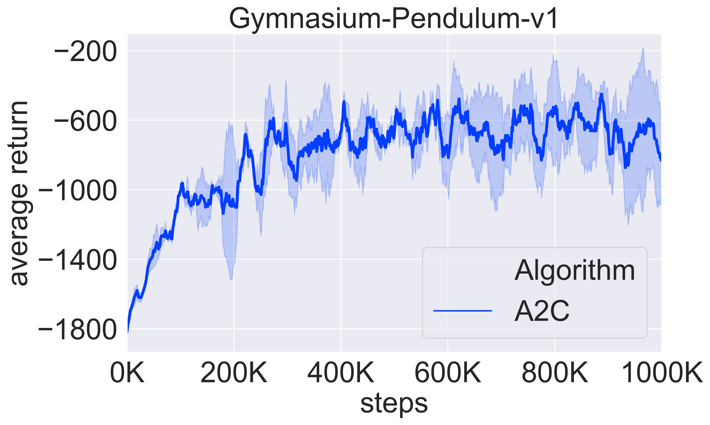

## A2C (Advantage Actor-Critic)

The repo provide two variants of A2C, namely A2CContinuous and A2CDiscrete.

The core of implementing A2C is collecting the trajectory and then using it to compute the policy gradient.

$J_\pi = - (r + \gamma V(s') - V(s)) * \log \pi(a|s)$

Tips:

1. When updating the policy network, td-target is of no gradient, so you should use `(r + γ*v_s_ - v_s).detach()`.
2. You can choose to update the policy after one episode or after one step, which are both acceptable.
3. For discrete variant, you can use `torch.distribution.Categorical` to model the action distribution.
4. You can run the code with `python main_a2c_continuous.py` or `python main_a2c_discrete.py`.

We use `gymnasium-Pendulum-v1` to test the continuous variant and use `gynasium-Cartpole-v1` to test the discrete variant.

