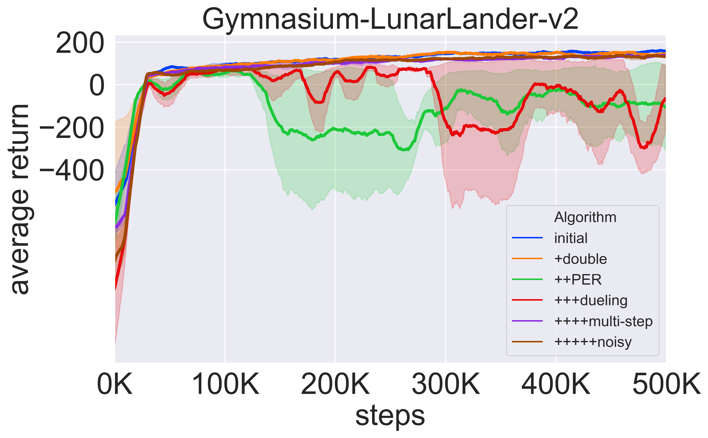

## DQN and DQN variants

### Citations

1. DQN-inital

    `@article{mnih2015human,
  title={Human-level control through deep reinforcement learning},
  author={Mnih, Volodymyr and Kavukcuoglu, Koray and Silver, David and Rusu, Andrei A and Veness, Joel and Bellemare, Marc G and Graves, Alex and Riedmiller, Martin and Fidjeland, Andreas K and Ostrovski, Georg and others},
  journal={nature},
  volume={518},
  number={7540},
  pages={529--533},
  year={2015},
  publisher={Nature Publishing Group}}`

2. Double-DQN 

    `@inproceedings{van2016deep,
    title={Deep reinforcement learning with double q-learning},
    author={Van Hasselt, Hado and Guez, Arthur and Silver, David},
    booktitle={Proceedings of the AAAI conference on artificial intelligence},
    volume={30},
    number={1},
    year={2016}
  }`

3. PER

    `@article{schaul2015prioritized,
  title={Prioritized experience replay},
  author={Schaul, Tom and Quan, John and Antonoglou, Ioannis and Silver, David},
  journal={arXiv preprint arXiv:1511.05952},
  year={2015}}`

4. Dueling-DQN
  
    `@inproceedings{wang2016dueling,
  title={Dueling network architectures for deep reinforcement learning},
  author={Wang, Ziyu and Schaul, Tom and Hessel, Matteo and Hasselt, Hado and Lanctot, Marc and Freitas, Nando},
  booktitle={International conference on machine learning},
  pages={1995--2003},
  year={2016},
  organization={PMLR}}`

5. Noisy-DQN

    `@article{fortunato2017noisy,
  title={Noisy networks for exploration},
  author={Fortunato, Meire and Azar, Mohammad Gheshlaghi and Piot, Bilal and Menick, Jacob and Osband, Ian and Graves, Alex and Mnih, Vlad and Munos, Remi and Hassabis, Demis and Pietquin, Olivier and others},
  journal={arXiv preprint arXiv:1706.10295},
  year={2017}}`

6. Categorical-DQN

    `@inproceedings{bellemare2017distributional,
  title={A distributional perspective on reinforcement learning},
  author={Bellemare, Marc G and Dabney, Will and Munos, R{\'e}mi},
  booktitle={International conference on machine learning},
  pages={449--458},
  year={2017},
  organization={PMLR}
}`

### Description
The repo provide the implementation of DQN and its all kinds of variants.

We use `Gymnasium-LunarLander-v2` to test the performance of all the variants.

#### 1. DQN initial
We use td-target to update the value function like:

$J = (r + \gamma \max_aQ_{target}(s', a) - Q(s,a))^2$

To implement this, we can use the following code : 

`q_target = critic_target(next_state).max(dim=1, keepdim=True)[0]`

`q_s_a = critic(state).gather(1, action.to(torch.int64))`

For epsilon-greedy strategy, we always apply epsilon-decay:

`epsilon = max(epsilon_min, epsilon - (epsilon_max - epsilon_min) * epsilon_decay)
`

#### 2. Double DQN
Double DQN holds that the action selected from the same Q network used to compute state-action value may tend to overestimate more easily, so Double DQN seperate the action selection and state-action value computation.

To implement this, we can use the following code : 
`a_target = critic(next_state).argmax(dim=1, keepdim=True)`

`q_target = critic_target(next_state).gather(1, a_target.to(torch.int64))`

#### 3. PER (Prioritized Experience Replay)
Reference: `https://zhuanlan.zhihu.com/p/631171588`

Some transitions may be more important among the replay buffer, thus should be sample more times. According to the optimization objective in DQN, the larger the td-error is, the more the corresponding transition should be trained.

If we choose the first $B$ transitions ranked by the td-error, we must face the following three problems:

1. a transition's td-error will be updated after being sampled. However, if put into replay buffer begin with a very small td-error, the transition is hard to be sampled again, which causes the insufficient usage.

2. td-error is inherently noisy, so greedy strategy is always unacceptable.

3. the algorithm may only concentrate on the transitions with large td-error, thus making it overfitting or collapsed.

To migitate the above problem, we choose to use stochastic sampling, with proportion defined as follows:

$p(i) = \frac{p_i^\alpha}{\sum_k p_k^\alpha}, p_i = |\delta_i| + \epsilon$

where $p_i$ is the priority of the $i$-th transition and $\alpha$ is a hyper-parameter controlling the magnitude of prioritized replaying. (When $\alpha=0$, it decays to uniformly sampling)

Further, when introducing the priority, the data distribution in the replay buffer is changed obviously. To lessen the influence to the convergence performance, we introduce the importance sampling mechanism to offset this distributional bias.

$w_i = (\frac{1}{N}\frac{1}{p(i)}) ^\beta$

When $\beta$ equals to 1, this will decay to uniformly sampling. The weight plays a role on the gradient of td-loss. Finally, don't forget to normalize the weight: 

$w_i = \frac{w_i}{\max_j w_j}$

In practice, we use SegmentTree to implement PER (Priority Proportional Sampling). Specifically, the leaf node saves the priority of transitions, and the root node saves the sum of priority, which is used to compute the $p(i)$.

#### 4. Dueling-DQN
Dueling-DQN uses Advantage Function and Value Function to decompose the traditional Q function network. 

$Q(s,a) = V(s) + A(s,a)$

As the following figure shows, we can intuitively imagine that this decomposition can help assgin the credit brought by the actions or the state.

Furthermore, this network structure can change the action-value function conditioning on the same state, though the action may be not sampled.

However, there is some ambiguity in the above decomposition equation, as $V(s)$ and $A(s,a)$ can fluctuate under a fixed $Q(s,a)$. To mitigate this problem, we always use:

$Q(s,a)=V(s)+A(s,a) - \frac{1}{|A|}\sum_{a'}A(s,a')$

$Q(s,a)=V(s)+A(s,a) - \max_{a'}A(s,a')$

#### 5. multi-step technique
One-step TD has the property of low variance but high bias while MC has the property of low bias but high variance. To balance the influence from high bias and high variance, we can introduce the multi-step technique.

Given the definition of N-step td target as follows:

$G_{t:t+n}=\sum_{k=0}^{n-1}\gamma^k R_{t+k+1}+\gamma^n\max_a Q(s_{t+n},a)$

In practice, we use N-step replay buffer to implement this technique.

It is worth noting that the above multi-step technique needs importance sampling to refine the distribution shift in fact. As the objective of td-learning stats, all of the reward except the initial should be generated by the target policy $\pi$ rather than $\pi_{old}$ in the replay buffer. Obviously, the multi-step technique violate this update rule.

$Q(s,a) = r(s,a) + \gamma \mathbb{E}_{s'\sim p,a'\sim \pi}[Q(s',a')]$

#### 6. Noisy-DQN
Noisy-DQN uses the Noisy-Linear-Layer to modify the trivial Linear layer to enhance the exploration capability compared to epsilon-greedy.

Consider a linear layer with $p$ inputs and $q$ outputs, denoted as:

$y=wx+b$

where $x\in \mathbb{R}^p$ is the layer input, $w\in\mathbb{R}^{q×p}$ is the weight matrix, and $b \in\mathbb{R}^q$ is the bias. The corresponding noisy linear layer is defined as:

$y=(\mu^w+\sigma^w\odot\epsilon^w)x+\mu^b+\sigma^b\odot\epsilon^b$

where $\mu^w,\sigma^w,\mu^b,\sigma^b$ are learnable parameters while $\epsilon^w, \epsilon^b$ are noise changed every training step.

We introduce the independent gaussian noise: each noise is independent, so there are $p*q+q$ parameters in total. 

By the way, the other paradigm is factorised gaussian noise, whose weight on the edge is determined by the multiplication of engaged neurons' weights, so there are $p+q$ parameters in total.

For the initialization of parameters, each parameter is subject to the uniform distribution $\mathcal{U}[-\sqrt{\frac{3}{p}}, \sqrt{\frac{3}{p}}]$, where $p$ denotes the input dimensions (for independent gaussian noise) and for the noise, it is computed by the following function:

$f(x)=sgn(x)\sqrt{|x|}$

where $x$ is subjected to the standard gaussian distribution.

#### 7. Categorical DQN
Categorical DQN uses the distribution to substitute the traditional expectation for modeling the value function. 

For the traditional Q-learning, we can define the Bellman operator and optimality operator as follows:

$(\mathcal{T}^\pi Q)(x,a) = R(x,a) + \gamma\mathbb{E}_{x',a'}Q(x',a')$

$(\mathcal{T} Q)(x,a) = R(x,a) + \gamma\mathbb{E}_{x'}\max_{a'} Q(x',a')$

The above two operators are proven to be $\gamma-$ contraction as:

$||\mathcal{T}^\pi Q_1 - \mathcal{T}^\pi Q_2||_\infty \le \gamma ||Q_1-Q_2 ||_\infty $

$||\mathcal{T} Q_1 - \mathcal{T} Q_2||_\infty \le \gamma ||Q_1-Q_2 ||_\infty $

Therefore, according to the Contraction Mapping Theorem, these operators $\mathcal{T}^\pi, \mathcal{T}$ have the only fixed points:

$\mathcal{T}^{\pi,\infty}Q=Q^\pi$

$\mathcal{T}^{\infty}Q=Q^*$

Let $Z(x,a)$ denote the distribution of value function and we can define the Bellman Operator and the optimality operator as follows:

$\mathcal{T}^\pi Z(x,a)=R(x,a) + \gamma P^\pi Z(x,a)$

$\mathcal{T}Z = \mathcal{T}^\pi Z, \pi \in \{\pi: \sum_a\pi(a|s)\mathbb{E} [Z(x,a)] = \max_{a}\mathbb{E} [Z(x,a)] \}$

The aim of Categorical-DQN is using $Z(x,a)$ to approximate the $\mathcal{T}Z(x,a)$

As Gaussian distribution is unimodal, Categorical-DQN uses C51 to model the multi-modal distribution. Let $\{z_0,...,z_{N-1}\}$ denotes the set of atoms. Given $V_{max}, V_{min}, N$, we can compute it as:

$z_i=V_{min}+i\Delta z, 0\le i< N, \Delta z=\frac{V_{max}-V_{min}}{N-1}$

Let $\{p_0,...,p_{N-1}\}$ denotes the distribution for a set of actions corresponding to these atoms. We can get $Q(x,a)$ by:

$Q(x,a)=\mathbb{E}[Z(x,a)] = \sum_{i=0}^{N-1} z_i p_i$

Furthermore, Categorical-DQN uses KL-divergence to estimate the distributional distance. 

For $a^*$ in the td-target $r + \gamma Z(x',a^*)$, we can get it by:

$Q(x_{t+1},a)=\sum_i z_i p_i(x_{t+1},a), a^*=\argmax Q(x_{t+1},a)$

Pay Attention! $z_i$ generated by $Z(x,a)$ may be different from $z_i$ generated by $R(x,a) + \gamma Z(x', a^*)$, so we need to align them to the location of settled atoms.