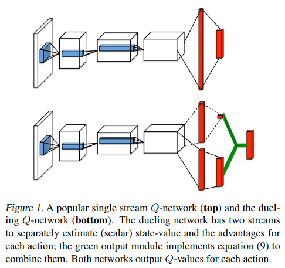

## DQN and DQN variants

### Citations

1. DQN-inital

  `@article{mnih2015human,
  title={Human-level control through deep reinforcement learning},
  author={Mnih, Volodymyr and Kavukcuoglu, Koray and Silver, David and Rusu, Andrei A and Veness, Joel and Bellemare, Marc G and Graves, Alex and Riedmiller, Martin and Fidjeland, Andreas K and Ostrovski, Georg and others},
  journal={nature},
  volume={518},
  number={7540},
  pages={529--533},
  year={2015},
  publisher={Nature Publishing Group}}`

2. Double-DQN 

  `@inproceedings{van2016deep,
    title={Deep reinforcement learning with double q-learning},
    author={Van Hasselt, Hado and Guez, Arthur and Silver, David},
    booktitle={Proceedings of the AAAI conference on artificial intelligence},
    volume={30},
    number={1},
    year={2016}
  }`

3. PER

  `@article{schaul2015prioritized,
  title={Prioritized experience replay},
  author={Schaul, Tom and Quan, John and Antonoglou, Ioannis and Silver, David},
  journal={arXiv preprint arXiv:1511.05952},
  year={2015}}`

4. Dueling-DQN
  `@inproceedings{wang2016dueling,
  title={Dueling network architectures for deep reinforcement learning},
  author={Wang, Ziyu and Schaul, Tom and Hessel, Matteo and Hasselt, Hado and Lanctot, Marc and Freitas, Nando},
  booktitle={International conference on machine learning},
  pages={1995--2003},
  year={2016},
  organization={PMLR}}`

### Description
The repo provide the implementation of DQN and its all kinds of variants.

We use epsilon-greedy exploration strategy to balance exploration and exploitation, which proven to have policy improvement guarantee.

#### 1. DQN initial
We use td-target to update the value function like:

$J = (r + \gamma \max_aQ_{target}(s', a) - Q(s,a))^2$

To implement this, we can use the following code : 

`q_target = critic_target(next_state).max(dim=1, keepdim=True)[0]`

`q_s_a = critic(state).gather(1, action.to(torch.int64))`

For epsilon-greedy strategy, we always apply epsilon-decay:

`epsilon = max(epsilon_min, epsilon - (epsilon_max - epsilon_min) * epsilon_decay)
`

#### 2. Double DQN
Double DQN holds that the action selected from the same Q network used to compute state-action value may tend to overestimate more easily, so Double DQN seperate the action selection and state-action value computation.

To implement this, we can use the following code : 
`a_target = critic(next_state).argmax(dim=1, keepdim=True)`

`q_target = critic_target(next_state).gather(1, a_target.to(torch.int64))`

#### 3. PER (Prioritized Experience Replay)
Reference: `https://zhuanlan.zhihu.com/p/631171588`

Some transitions may be more important among the replay buffer, thus should be sample more times. According to the optimization objective in DQN, the larger the td-error is, the more the corresponding transition should be trained.

If we choose the first $B$ transitions ranked by the td-error, we must face the following three problems:

1. a transition's td-error will be updated after being sampled. However, if put into replay buffer begin with a very small td-error, the transition is hard to be sampled again, which causes the insufficient usage.

2. td-error is inherently noisy, so greedy strategy is always unacceptable.

3. the algorithm may only concentrate on the transitions with large td-error, thus making it overfitting or collapsed.

To migitate the above problem, we choose to use stochastic sampling, with proportion defined as follows:

$p(i) = \frac{p_i^\alpha}{\sum_k p_k^\alpha}, p_i = |\delta_i| + \epsilon$

where $p_i$ is the priority of the $i$-th transition and $\alpha$ is a hyper-parameter controlling the magnitude of prioritized replaying. (When $\alpha=0$, it decays to uniformly sampling)

Further, when introducing the priority, the data distribution in the replay buffer is changed obviously. To lessen the influence to the convergence performance, we introduce the importance sampling mechanism to offset this distributional bias.

$w_i = (\frac{1}{N}\frac{1}{p(i)}) ^\beta$

When $\beta$ equals to 1, this will decay to uniformly sampling. The weight plays a role on the gradient of td-loss. Finally, don't forget to normalize the weight: 

$w_i = \frac{w_i}{\max_j w_j}$

In practice, we use SegmentTree to implement PER (Priority Proportional Sampling). Specifically, the leaf node saves the priority of transitions, and the root node saves the sum of priority, which is used to compute the $p(i)$.

#### 4. Dueling-DQN
Dueling-DQN uses Advantage Function and Value Function to decompose the traditional Q function network. 

$Q(s,a) = V(s) + A(s,a)$

As the following figure shows, we can intuitively imagine that this decomposition can help assgin the credit brought by the actions or the state.

Furthermore, this network structure can change the action-value function conditioning on the same state, though the action may be not sampled.

However, there is some ambiguity in the above decomposition equation, as $V(s)$ and $A(s,a)$ can fluctuate under a fixed $Q(s,a)$. To mitigate this problem, we always use:

$Q(s,a)=V(s)+A(s,a) - \frac{1}{|A|}\sum_{a'}A(s,a')$

$Q(s,a)=V(s)+A(s,a) - \max_{a'}A(s,a')$