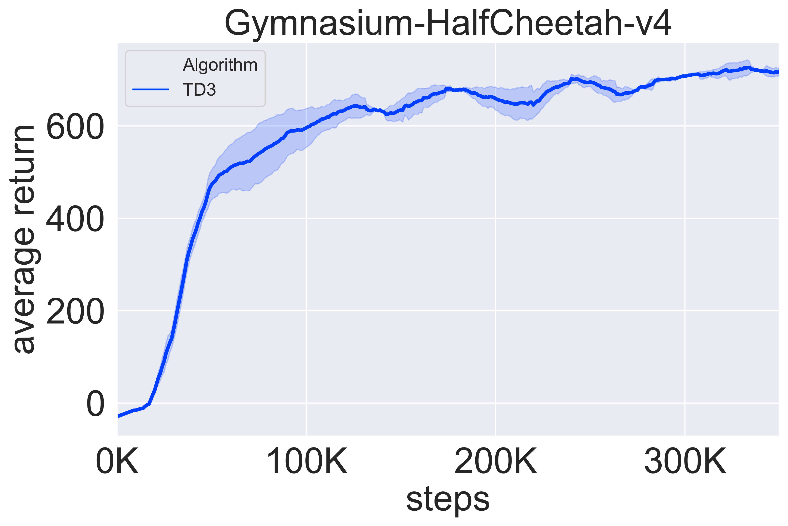

## TD3

Citation

`@inproceedings{fujimoto2018addressing,
  title={Addressing function approximation error in actor-critic methods},
  author={Fujimoto, Scott and Hoof, Herke and Meger, David},
  booktitle={International conference on machine learning},
  pages={1587--1596},
  year={2018},
  organization={PMLR}
}`

The repo provide the implementation of TD3.

TD3 is the extension of DDPG. Specifically, TD3 brings three extra advantages to improve the performance of DDPG. However, TD3 is more sensitive to the choice of hyper-parameters than DDPG empirically.

TD3 contains six networks in total as using double-Q architecture, namely actor, target actor, critic1, critic2, target critic1, target critic2.

Three advantages:

1. double-critic: We can use $\min \{Q_1(s,a),Q_2(s,a)\}$ to get the estimation of value function. Though having the same optimization objective, these two critics have different initial parameters, which can effectively mitigate overestimation.

2. actor delay update: Actor is subjected to the critics during the optimization process. Therefore, if the critics are changed frequently, the actor may be stuck in sub-optimality. We can adjust the update frequency of the actor to let critics be ready.

3. target policy smooth regularization: When updating the critics, we add some noise to the action generated by the target policy network, which aims at gaining a robust td-target across a rational range.

Tips:

1. You can run the code with `python main_td3.py`.

We use `gymnasium-HalfCheetah-v4` to test TD3.

