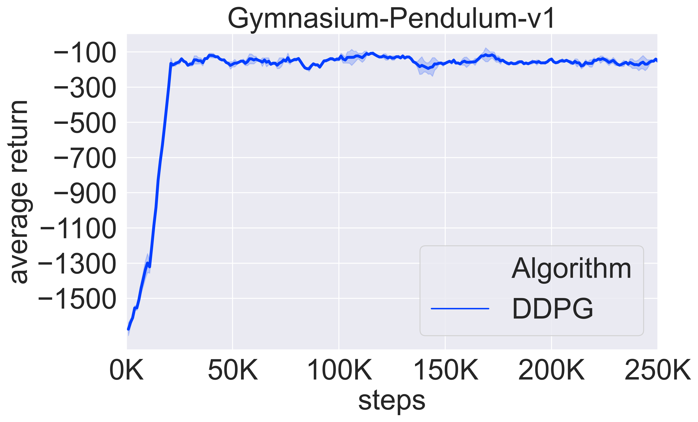

## DDPG

Citations

`@article{lillicrap2015continuous,
  title={Continuous control with deep reinforcement learning},
  author={Lillicrap, Timothy P and Hunt, Jonathan J and Pritzel, Alexander and Heess, Nicolas and Erez, Tom and Tassa, Yuval and Silver, David and Wierstra, Daan},
  journal={arXiv preprint arXiv:1509.02971},
  year={2015}
}`

The repo provide the implementation of DDPG.

DDPG contains four networks in total, namely actor, target actor, critic and target critic networks. 

DDPG uses the deterministic policy to generate the action, whose loss is :

$J_\pi = - Q(s, \pi(a|s))$

note that the Q function here do not use the target critic network, so you must freeze the parameters when updating the policy network as 

`for param in self.critic.parameters():`

&ensp;&ensp;&ensp;&ensp; `param.requires_grad = False`

DDPG use td-error to update the critic network: 

$J_Q = (r + \gamma Q_{target}(s', \pi_{target}(s')) - Q(s,a))^2$

We can use soft-update rules to update the target networks

`for param, target_param in zip(actor.parameters(), actor.parameters()):`

&ensp;&ensp;&ensp;&ensp; `target_param.data.copy_(target_update_coee * param + (1 - target_update_coee) * target_param)`

Tips:

1. You can run the code with `python main_ddpg.py`.

We use `gymnasium-Pendulum-v1` to test the continuous variant and use `gynasium-Cartpole-v1` to test the discrete variant.

